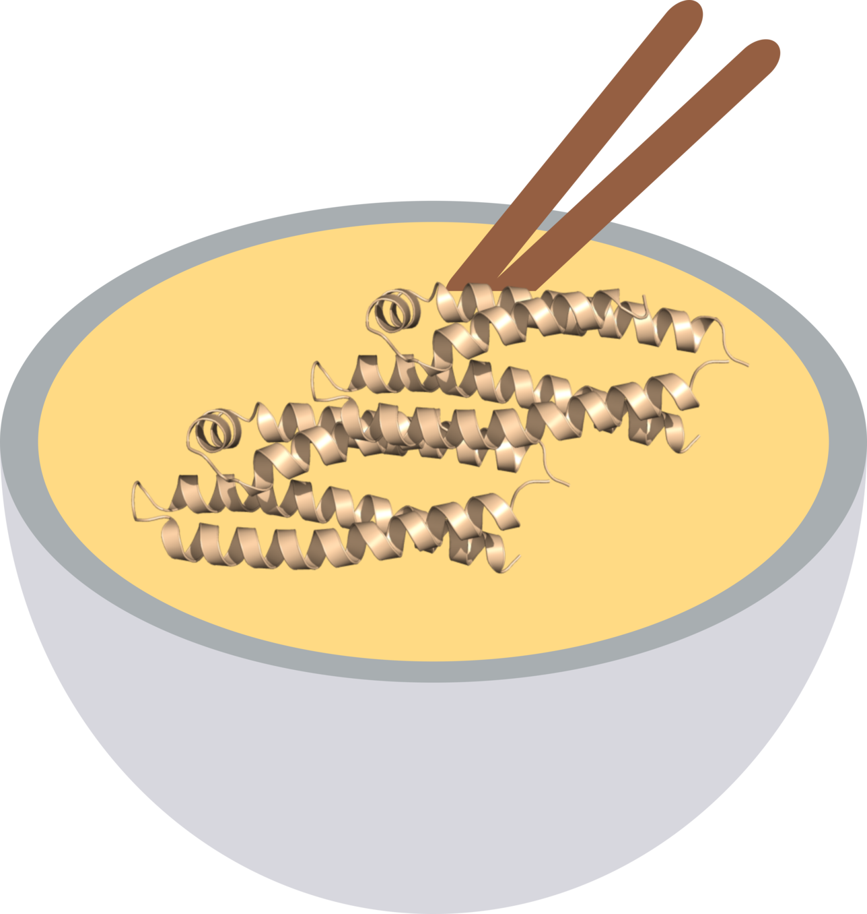

# UdonPred: Untangling Protein Intrinsic Disorder Prediction


**UdonPred** is a set of models for predicting disorder based on different definitions of disorder, reaching state-of-the-art performance using simple, [ProstT5](https://github.com/mheinzinger/ProstT5)-based embeddings. 
The ability of models trained on one definition of disorder to generalise to others was accessed in the corresponding [publication](https://doi.org/10.64898/2026.01.26.701679).

The training data can be found on [here](https://doi.org/10.6084/m9.figshare.31444642).

For the old version submitted to CAID3 go to [https://github.com/jschlensok/udonpred](https://github.com/jschlensok/udonpred).

## Installation
1. `git clone https://github.com/DavidWagemann/UdonPred.git`
2. `cd UdonPred`
3. `uv sync`

## Usage
`uv run predict.py {path to fasta} {path to weights}`

You can use the following options:
- `--target`: chooses the model trained on the specified dataset (trizod, chezod, softdis, pdbflex, atlas, plddt, disprot). The default is trizod.
- `--output`: sets the output directory path. Each sequence will be saved as a .caid file. The output will be written to the terminal if this is not set.
- `--batch-size`: sets the total sequence length per batch. Try reducing this if you get an out of memory error.
- `--device`: sets the device used for inference (cpu or cuda). Uses cuda by default if available.
- `--smooth`: Applies gaussian smoothing with the give sigma to the results in order to remove prediction noise. 

## Training a Model
UdonPred can be retrained by placing the required data as jsonl files in a data/ subfolder and pointing to it in `config/data.yaml`. The training configuration and architecture can be changed in `config/config.yaml` and `config/architecture.yaml` respectively. To start the training process, run `uv run run.py train`. 

After training is complete, a checkpoint can be exported for use with the prediction script using `uv run export.py {path to checkpoint}`. For export options, see `uv run export.py --help`.

## How to Cite
```
@article {UdonPred,
	author = {Schlensok, Julius and Wagemann, David and Senoner, Tobias and Haak, Markus and Rost, Burkhard},
	title = {UdonPred: Untangling Protein Intrinsic Disorder Prediction},
	elocation-id = {2026.01.26.701679},
	year = {2026},
	doi = {10.64898/2026.01.26.701679},
	publisher = {Cold Spring Harbor Laboratory},
	URL = {https://www.biorxiv.org/content/early/2026/01/28/2026.01.26.701679},
	eprint = {https://www.biorxiv.org/content/early/2026/01/28/2026.01.26.701679.full.pdf},
	journal = {bioRxiv}
}
```
