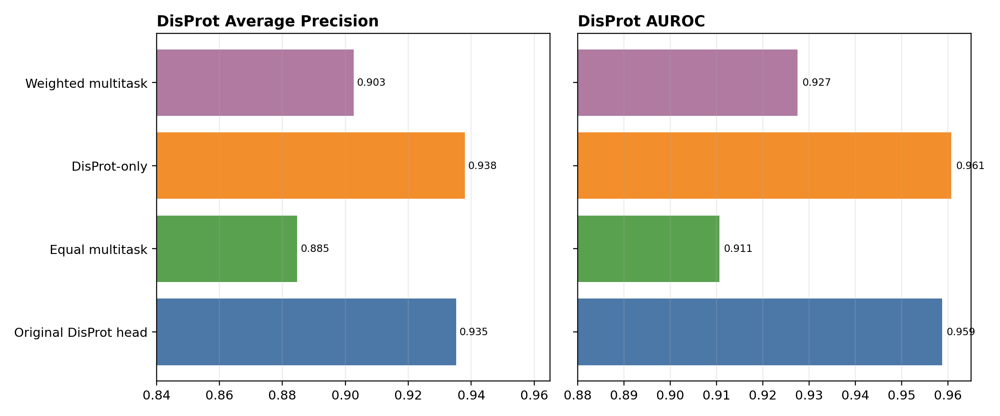
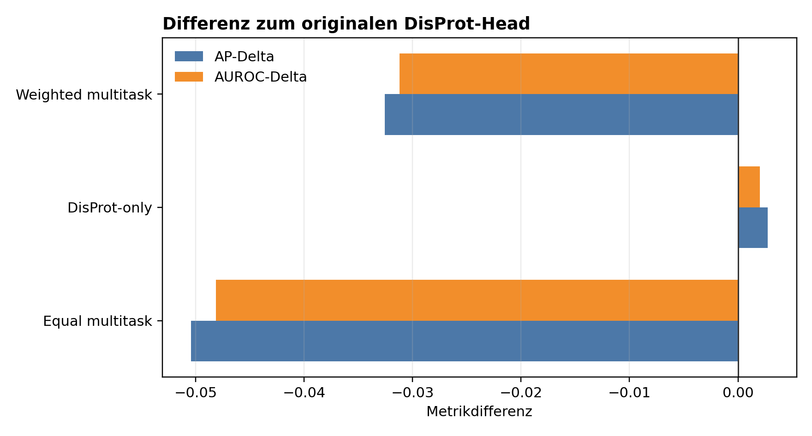
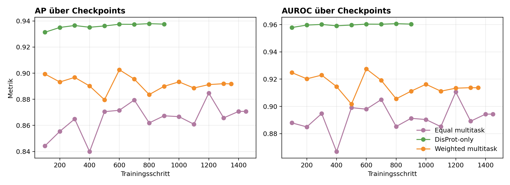
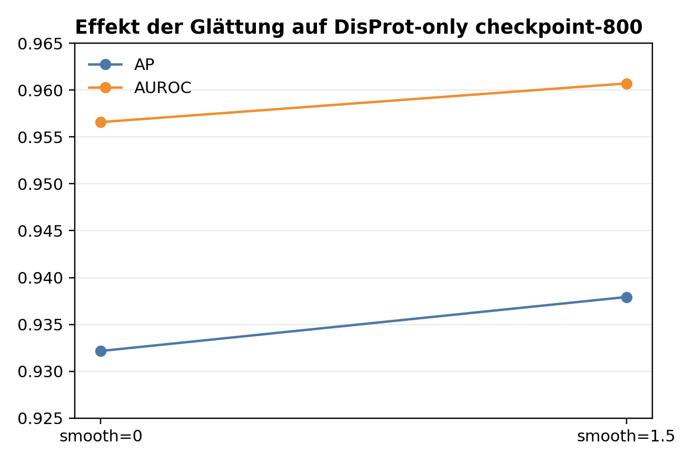

# DisProt-fokussierter UdonPred-Verbesserungsreport

## Kurzfassung

Ziel war, UdonPred gezielt für das DisProt-Ziel zu verbessern. PDBflex und ATLAS wurden bewusst ignoriert. Wenn TriZOD-artige Hilfslabels verwendet wurden, wurde das originale `trizod` durch `trizod_updated` ersetzt. Das beste Ergebnis kam aus einem reinen DisProt-Retraining. Der beste neue Checkpoint war `UdonPred/checkpoints_caid4/caid4_disprot_only/checkpoint-800` mit AP `0.937925` und AUROC `0.960712` auf dem DisProt-Testset.

Verglichen mit dem originalen UdonPred-DisProt-Head ist das unter der standardmäßig geglätteten Auswertung eine kleine, aber konsistente Verbesserung:

- AP: `+0.002763`
- AUROC: `+0.002007`

## Experimentelles Setup

Alle Experimente nutzten die lokale UdonPred-Architektur mit ProstT5-Embeddings und wurden auf demselben DisProt-Testsplit ausgewertet: 99,239 gelabelte Residuen, 31,401 positive Residuen, positiver Anteil 0.3164. Falls nicht anders angegeben, wurden die Scores mit dem UdonPred-Standard `smooth=1.5` geglättet.

Getestete Strategien:

- **Original DisProt head:** pretrained UdonPred-Baseline aus `results/udonpred_matrix/matrix.csv`.
- **Equal multitask:** ein gemeinsamer Head auf `disprot`, `trizod_updated`, `chezod`, `softdis` und `plddt` mit gleichen Loss-Gewichten; `trizod`, `atlas` und `pdbflex` deaktiviert.
- **DisProt-only:** ein Head nur auf DisProt trainiert.
- **Weighted multitask:** dieselben Hilfsziele wie beim Equal-Multitask, aber DisProt-Loss-Gewicht 5 und jedes Hilfsziel-Gewicht 0.1.

## Ergebnisse

| Strategie | Bester Schritt | DisProt AP | DisProt AUROC | Delta AP | Delta AUROC |
| --- | --- | --- | --- | --- | --- |
| Original DisProt head |  | 0.935162 | 0.958705 | 0.000000 | 0.000000 |
| Equal multitask | 1200 | 0.884743 | 0.910587 | -0.050419 | -0.048118 |
| DisProt-only | 800 | 0.937925 | 0.960712 | 0.002763 | 0.002007 |
| Weighted multitask | 600 | 0.902599 | 0.927489 | -0.032563 | -0.031216 |

## Checkpoint-Verhalten

Das Checkpoint-Ranking zeigt, dass ein Stopp nach gemischtem `eval_loss` nicht ausgereicht hätte. Entscheidend sind DisProt AP und AUROC. DisProt-only erzeugte die besten Checkpoints, während beide Multitask-Varianten klar unter der originalen DisProt-Baseline blieben.

Der beste Equal-Multitask-Checkpoint erreichte AP `0.884743` und AUROC `0.910587`. Eine stärkere DisProt-Gewichtung verbesserte das Multitask-Ergebnis auf AP `0.902599` und AUROC `0.927489`, blieb aber weiterhin unter der originalen Baseline und deutlich unter DisProt-only.

## Glättungs-Check

Beim besten DisProt-only-Checkpoint reduzierte das Entfernen der Glättung die Leistung auf AP `0.932170` und AUROC `0.956584`. Die Hauptverbesserung sollte daher als standardmäßig geglättetes UdonPred-Ergebnis berichtet werden. Für einen vollständig passenden ungeglätteten Vergleich müsste auch der originale pretrained DisProt-Head mit `smooth=0` ausgewertet werden.

## Interpretation

Die Experimente zeigen einen klaren Zielkonflikt im Shared-Head-Multitask-Setup. Kontinuierliche Hilfslabels aus `trizod_updated`, `chezod`, `softdis` und `plddt` halfen DisProt nicht, wenn alles durch einen gemeinsamen Output-Head gelernt wurde. Eine stärkere DisProt-Gewichtung reduzierte den Schaden, erreichte aber nicht die Leistung des reinen DisProt-Trainings.

Die wichtigste praktische Schlussfolgerung:

> Für dieses Setup ist ein fokussiertes DisProt-only-Retraining die empfohlene Verbesserung. Hilfsdatensätze sollten nicht einfach in denselben Head gemischt werden, solange keine bessere Architektur, kein zweistufiges Fine-tuning oder kein task-spezifisches Routing verwendet wird.

## Erzeugte Dateien

- Zusammenfassungs-CSV: `results/disprot_focus_experiment_summary.csv`
- Equal-Multitask-Checkpoint-Ranking: `results/disprot_focus_checkpoint_eval/checkpoint_summary.csv`
- DisProt-only-Checkpoint-Ranking: `results/disprot_only_checkpoint_eval/checkpoint_summary.csv`
- Weighted-Multitask-Checkpoint-Ranking: `results/disprot_weighted_multitask_checkpoint_eval/checkpoint_summary.csv`
- Exportierter ONNX-Head: `UdonPred/weights_disprot_only/disprot_only.onnx`
- CAID-Predictions vom exportierten Head: `results/disprot_only_predictions/`

