# Global Comparison of Protein Intrinsic Disorder Predictors on the Human Proteome

## Agreement, systematic disagreement, and why high-performing predictors can produce different biological pictures

**Data scope:** 14 predictor outputs, up to 20,659 human proteins and approximately 11.46 million residues  
**Primary analysis:** residue-level and protein-level predictor agreement, score-scale diagnostics, protein-ranking overlap, hierarchical clustering, annotation-target comparison, protein-length effects, and technical quality control  
**Interpretive focus:** whether predictors recover a common disorder signal, which predictors form distinct subgroups, and which methodological choices can explain the observed differences

---

## Contents

1. [Scientific Background](#1-scientific-background)
2. [Predictors and Their Methodological Context](#2-predictors-and-their-methodological-context)
3. [Data and Analytical Design](#3-data-and-analytical-design)
4. [Global Predictor Agreement](#4-global-predictor-agreement)
5. [Mean Agreement and Predictor Centrality](#5-mean-agreement-and-predictor-centrality)
6. [Hierarchical Clustering](#6-hierarchical-clustering)
7. [Extreme Protein Rankings](#7-extreme-protein-rankings)
8. [Why DisPredict3 Looks Different](#8-why-dispredict3-looks-different)
9. [Protein-Length Effects](#9-protein-length-effects)
10. [Training Annotation and Learned Behavior](#10-training-annotation-and-learned-behavior)
11. [Detailed Causes of Predictor Disagreement](#11-detailed-causes-of-predictor-disagreement)
12. [Technical Quality Control and Potential Artifacts](#12-technical-quality-control-and-potential-artifacts)
13. [Integrated Interpretation](#13-integrated-interpretation)
14. [Practical Recommendations](#14-practical-recommendations)
15. [Limitations and Next Analyses](#15-limitations-and-next-analyses)
16. [Conclusions](#16-conclusions)

---

## Abstract

Protein intrinsic disorder is not a single directly measurable quantity. Depending on the experimental source, a residue may be described as disordered because it has unusual nuclear magnetic resonance chemical shifts, lacks electron density in a crystal structure, appears flexible across structural models, is curated as functionally disordered, or receives low confidence from a structure-prediction system. Predictors trained on these targets are therefore not guaranteed to reproduce the same score profile, even when all are described as intrinsic disorder predictors.

This report compares six UdonPred models and eight external predictors across the human proteome. Agreement was measured at two levels. Pooled residue-level Spearman correlation asks whether two methods rank individual residues similarly, with long proteins contributing more observations. Protein-level Spearman correlation first averages the scores within each protein and then asks whether two methods rank whole proteins similarly, giving each protein equal weight. Complementary analyses compared standardized score differences, top-10% disorder-prone proteins, high-score residue sets, hierarchical clusters, protein-length effects, and the agreement between the experimental annotation sources used by UdonPred.

The results show a strong shared disorder signal, but not a single homogeneous predictor family. The UdonPred models exhibit the highest within-group agreement, with mean pairwise Spearman correlations of 0.85 at residue level and 0.92 at protein level. A broad consensus group also includes PUNCH2-light, SETH, ADOPT, and metapredict. DisPredict3, DisoFLAG, and DisorderUnetLM form a partially distinct group, while IUPred3 is comparatively independent. DisPredict3 has the lowest mean agreement with the full panel, especially for whole-protein ranking, yet it agrees substantially with DisoFLAG and DisorderUnetLM. Its lower consensus agreement therefore does not imply poor benchmark accuracy. Instead, it indicates that DisPredict3 emphasizes a different subset of the disorder signal and uses a markedly conservative score distribution.

The strongest explanation for the observed differences is a combination of target-definition effects and model-design effects. UdonPred provides a particularly informative controlled comparison because its models share the same ProstT5-based representation and lightweight architecture while changing the training annotation. Their high but imperfect agreement demonstrates that annotation choice alone changes proteome-wide predictions. External predictors add further variation through energy-based reasoning, consensus imitation, protein-language-model choice, convolutional or recurrent context modeling, multi-task learning, feature engineering, and binary versus continuous objectives. Protein length also matters: predictor disagreement is highest below 200 residues and above 1,000 residues, and the CAID-style subgroup assigns systematically lower disorder ranks to long proteins than most of the consensus group.

The main conclusion is that the predictors learn a common core signal associated with disorder, but they operationalize different biological and experimental definitions around that core. Benchmark performance, correlation with other predictors, and biological interpretability are therefore three separate questions and must not be treated as interchangeable.

### Quick reader's guide

The report uses three separate ideas that should not be conflated:

- **Agreement:** two predictors rank residues or proteins similarly. This is measured mainly with Spearman correlation, top-decile overlap, and high-score residue overlap.
- **Calibration:** two predictors attach comparable numerical meanings to their scores. This is not guaranteed, even when both scores are bounded or both are oriented as higher = more disorder-like.
- **Accuracy:** a predictor matches an independent experimental reference. The human-proteome comparison does not directly measure this because it has no complete proteome-wide ground truth.

Thus, a low-agreement predictor is not automatically wrong. It may be accurate for a different benchmark target, use a different score calibration, or emphasize a biologically distinct subset of disorder-like residues.

---

## 1. Scientific Background

### 1.1 Intrinsic disorder is a continuum and a context-dependent property

Intrinsically disordered proteins and regions do not adopt one stable three-dimensional structure under the relevant conditions. Instead, they sample ensembles of conformations. Their behavior can change after binding, post-translational modification, changes in redox state, molecular crowding, or changes in the chemical environment. This immediately creates an annotation problem: a binary label such as *ordered* or *disordered* compresses a continuous and context-dependent phenomenon into two classes.

Different experimental techniques observe different aspects of this phenomenon:

- **NMR chemical shifts** quantify local structural deviations and can represent disorder continuously.
- **Missing residues in crystallographic structures** indicate absent electron density, but absence can result from flexibility, construct design, unresolved termini, or experimental limitations.
- **Curated DisProt regions** represent experimentally supported disorder and often include functional and conditional annotations.
- **Structural flexibility datasets** capture movement or variation, which overlaps with disorder but is not identical to it.
- **AlphaFold pLDDT** is a model-confidence score. Low confidence is often associated with intrinsic disorder, but uncertainty is not itself an experimental observation of disorder.

Consequently, disagreement between predictors can be biologically meaningful. Two predictors may both be internally valid while estimating different target concepts.

### 1.2 The central research question

The analysis addresses four linked questions:

1. Do disorder predictors recover a common signal across the human proteome?
2. Which predictors form coherent groups, and which behave as outliers?
3. Can the differences be connected to training annotations, model architecture, score distribution, or protein length?
4. Why can a predictor with strong performance in a CAID benchmark still correlate weakly with other predictors on the human proteome?

The fourth question is especially important. A benchmark evaluates predictions against a particular reference set and metric. Predictor agreement instead measures similarity between model outputs on another sequence population. High benchmark performance does not mathematically require high agreement with other methods.

---

## 2. Predictors and Their Methodological Context

### 2.1 UdonPred models: controlled variation of the target definition

UdonPred is a set of lightweight models that use ProstT5 protein-language-model embeddings. The local implementation uses the same two-layer feed-forward architecture for all targets, while the loss and training annotations differ. Continuous targets use mean-squared-error regression; the DisProt target uses binary cross-entropy. This makes UdonPred unusually useful for the current question: much of the representation and model architecture is held constant, allowing differences among the six models to be interpreted primarily as target-data effects.

The report includes the following UdonPred models:

| Model | Main target concept | Native interpretation in this analysis |
|---|---|---|
| `trizod` | NMR-related continuous order/disorder | Higher transformed score = more disorder |
| `chezod` | Continuous NMR chemical-shift Z-score | Native direction reversed for comparison |
| `softdis` | Continuous soft disorder annotation | Higher score = more disorder |
| `atlas` | Continuous dynamics/flexibility-related target | Higher score = more disorder-like target signal |
| `plddt` | AlphaFold confidence-related target | Native direction reversed; low confidence treated as disorder-like |
| `disprot` | Curated binary disorder annotation | Higher score = greater probability/propensity of curated disorder |

The PDBflex model was excluded from the main all-predictor panel because it behaved as a problematic or incomplete comparison target in the available whole-proteome setup. The report therefore focuses on the six consistently available models.

### 2.2 External predictors

The external methods represent several distinct modeling philosophies:

| Predictor | Main methodological principle | Expected source of distinct behavior |
|---|---|---|
| **SETH** | Shallow CNN on ProtT5 embeddings, trained to regress continuous CheZOD scores | Strong affinity to NMR/CheZOD-like disorder and local sequence context |
| **ADOPT** | ESM transformer embeddings with supervised prediction of continuous CheZOD Z-scores | NMR target, different protein language model, and a 1,024-residue input limitation |
| **metapredict** | Bidirectional recurrent network trained to reproduce consensus disorder scores | Tends toward the center of established predictor consensus |
| **IUPred3** | Biophysical energy-estimation approach rather than supervised imitation of a modern benchmark set | Captures inability to form stabilizing interactions; relatively independent signal |
| **PUNCH2-light** | CNN using one-hot and ProtTrans features without the MSA-Transformer component | Sequence and protein-language-model signal, with crystallography-derived target bias |
| **DisoFLAG** | ProtT5-based recurrent and graph model that jointly models disorder and disorder-related functions | Multi-task functional information and graph-based coupling between outputs |
| **DisorderUnetLM** | Attention U-Net applied to ProtTrans features | Multiscale segmentation behavior and binary disorder objective |
| **DisPredict3** | ESM representation plus flDPnn-derived features, PCA, and LightGBM | Tree-based decision boundaries, engineered features, binary optimization, and conservative scores |

This taxonomy already predicts that perfect agreement is unlikely. SETH and ADOPT are trained against continuous NMR-derived targets, metapredict explicitly learns a consensus, IUPred3 uses a physical energy model, PUNCH2-light is strongly influenced by crystallographic missing-residue labels, and the newer CAID-style models use different protein language models and binary classification strategies.

### 2.3 Literature basis for the methodological interpretation

The method descriptions above are grounded in the respective primary publications:

- [UdonPred](https://doi.org/10.64898/2026.01.26.701679) uses ProstT5 embeddings and separate models for different disorder definitions.
- [SETH](https://pmc.ncbi.nlm.nih.gov/articles/PMC9580958/) uses a shallow CNN on ProtT5 embeddings to predict continuous CheZOD scores.
- [ADOPT](https://pmc.ncbi.nlm.nih.gov/articles/PMC10150328/) combines ESM-derived residue embeddings with supervised prediction of NMR chemical-shift Z-scores.
- [metapredict](https://doi.org/10.1016/j.bpj.2021.08.039) is trained to reproduce consensus disorder scores.
- [IUPred3](https://pmc.ncbi.nlm.nih.gov/articles/PMC8262696/) uses an energy-estimation principle and is not simply a supervised replica of the other models.
- [PUNCH2](https://pmc.ncbi.nlm.nih.gov/articles/PMC11940444/) combines modern sequence representations; PUNCH2-light omits the MSA-Transformer component and its authors note bias from crystallography-derived labels.
- [DisoFLAG](https://pubmed.ncbi.nlm.nih.gov/38166858/) combines ProtT5 features, recurrent context modeling, and a graph of disorder-related functional outputs.
- [DisorderUnetLM](https://arxiv.org/abs/2404.08108) applies an Attention U-Net to ProtTrans features.
- [DisPredict3](https://doi.org/10.1016/j.amc.2024.128630) combines ESM and flDPnn-derived features with PCA and LightGBM and was developed using a DisProt-derived binary dataset.

---

## 3. Data and Analytical Design

### 3.1 Proteome coverage

The reference human proteome contains 20,659 sequences and 11,456,702 residues. Most predictors cover the entire reference. Important exceptions are:

- DisPredict3: 20,596 proteins, missing 63 reference proteins.
- DisoFLAG: 20,195 proteins, missing 464 reference proteins.
- PUNCH2-light: 20,077 proteins, missing 582 reference proteins.
- ADOPT: all protein identifiers are present, but 2,317 predictions are shorter than the reference because of its length limit.
- metapredict: 67 shared proteins have a sequence mismatch relative to the reference and require caution in residue-position analyses.

For every pairwise statistic, only common finite values are used. Sample size is therefore reported alongside agreement.

### 3.2 Score orientation and scale

All scores were oriented so that a larger transformed value means more disorder-like behavior. CheZOD, pLDDT, and ADOPT were multiplied by -1 because their native direction is lower = more disorder.

Orientation does **not** make numerical scales comparable. A pLDDT-derived score around -75, a CheZOD value around -8, and a probability-like score around 0.4 cannot be compared by subtraction in their raw form. The analysis therefore uses:

- **Spearman correlation** for rank agreement, because it is invariant to monotonic rescaling.
- **Z-score mean absolute error (MAE)** for comparing standardized score patterns.
- **Within-predictor percentiles** for cross-predictor high-score sets and protein-level disagreement.

A universal 0.5 threshold was deliberately not used. A bounded score is not automatically calibrated to the same biological decision boundary as another bounded score.

### 3.3 Agreement metrics

#### Pooled residue-level Spearman

All matched residues are concatenated and correlated. This asks whether predictors rank residue positions similarly across the complete proteome. Because every residue is an observation, long proteins receive more weight.

#### Protein-level Spearman

Each predictor is averaged within each protein, and the vectors of protein means are correlated. This asks whether predictors agree on which proteins are globally disorder-prone. Every protein receives equal weight regardless of length.

#### Mean per-protein residue Spearman

For the focused DisPredict3 analysis, a separate Spearman correlation is calculated within each protein and then averaged over proteins. This avoids domination by long proteins but asks a different question from pooled residue-level correlation.

#### Z-score MAE

Each score vector is standardized before absolute differences are averaged. This distinguishes similar rankings from similar profile shapes after scale normalization. Lower values mean closer standardized profiles.

#### Top-10% protein overlap

For each pair, the 10% of common proteins with the highest mean disorder score are selected. The overlap measures whether the methods prioritize the same extreme proteins, not merely whether their overall rankings correlate.

#### Quantile-based residue overlap

The highest-scoring 10% of residues are selected separately for each predictor. Jaccard overlap and shared fractions measure whether two predictors place their strongest signals at the same positions without imposing a shared raw-score threshold.

---

## 4. Global Predictor Agreement

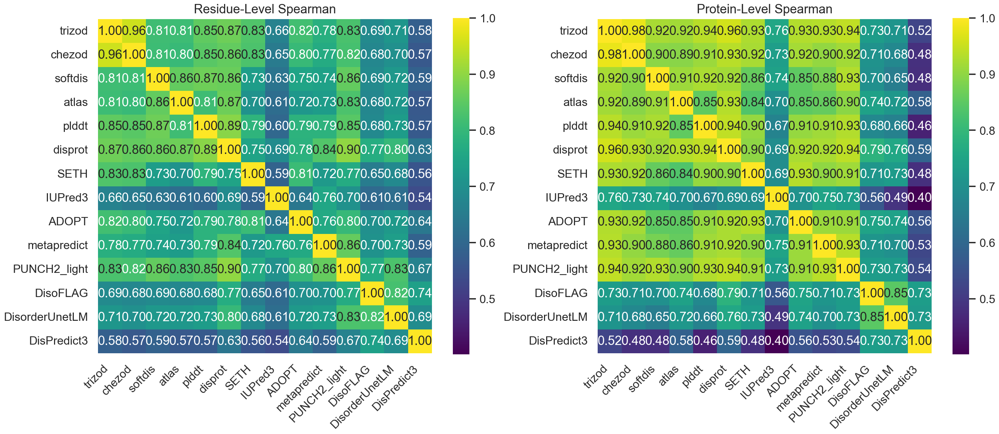

*Figure 1. Pairwise Spearman agreement across the human proteome. The left panel pools matched residues; the right panel correlates protein mean scores. Darker cells indicate lower agreement.*

### 4.1 A strong common signal exists

Most pairwise correlations are positive and many exceed 0.7. This is the strongest evidence that the predictors are not producing unrelated outputs. Despite different training data and architectures, they recover a common sequence signal associated with disorder. This common signal likely includes amino-acid composition, low complexity, reduced hydrophobic packing potential, charge patterning, flexible linkers, and sequence contexts represented in protein-language-model embeddings.

The common signal becomes especially visible at protein level. Many consensus-group pairs reach protein-level correlations above 0.9. Averaging over residues removes local boundary differences and prediction noise, allowing agreement about global disorder burden to emerge.

### 4.2 UdonPred models agree strongly but not perfectly

The six UdonPred models have a mean within-group Spearman correlation of:

- **0.852 at pooled residue level**
- **0.922 at protein level**

TriZOD and CheZOD are the closest pair, with residue-level Spearman of approximately 0.96 and protein-level Spearman of approximately 0.98. This is expected because both are closely related to NMR-derived continuous structural order/disorder.

However, other UdonPred pairs are visibly less similar. ATLAS, SoftDis, pLDDT, and DisProt do not reproduce the same residue ranking even though their models share the same underlying architecture. This is direct evidence that the annotation target affects what the model learns. The architecture alone cannot explain the disagreement because it is largely controlled within the UdonPred family.

### 4.3 Protein-level agreement is usually higher than residue-level agreement

For much of the main consensus group, protein-level correlations exceed residue-level correlations. This means two predictors can agree that a protein is generally disorder-rich while disagreeing about exact boundaries, short segments, or local score intensity.

This pattern is biologically plausible. Local disorder boundaries are sensitive to smoothing, context-window size, thresholding, and the experimental definition used during training. Protein averages suppress these details. Therefore:

- high protein-level but moderate residue-level correlation means **agreement on global burden but disagreement on localization**;
- high values at both levels mean **agreement on both burden and residue ranking**;
- low protein-level correlation indicates that methods prioritize different proteins, not just different boundaries.

### 4.4 DisPredict3 is the clearest global outlier

DisPredict3 has residue-level correlations of roughly 0.54-0.67 with most predictors and protein-level correlations of roughly 0.40-0.59 with the main consensus group. Its strongest relationships are with DisoFLAG and DisorderUnetLM, where protein-level Spearman rises to approximately 0.73.

This pattern is structured, not random. If DisPredict3 were simply noisy, it would not form reproducible high-agreement relationships with a specific subgroup. Instead, the matrix suggests two partially overlapping disorder concepts:

1. a broad consensus/NMR/UdonPred-like signal;
2. a CAID-style pLM/binary-classification signal emphasized by DisPredict3, DisoFLAG, and DisorderUnetLM.

PUNCH2-light bridges these groups. It is an external CAID-era model, but its output is strongly aligned with DisProt, pLDDT, TriZOD, CheZOD, and other consensus methods.

---

## 5. Mean Agreement and Predictor Centrality

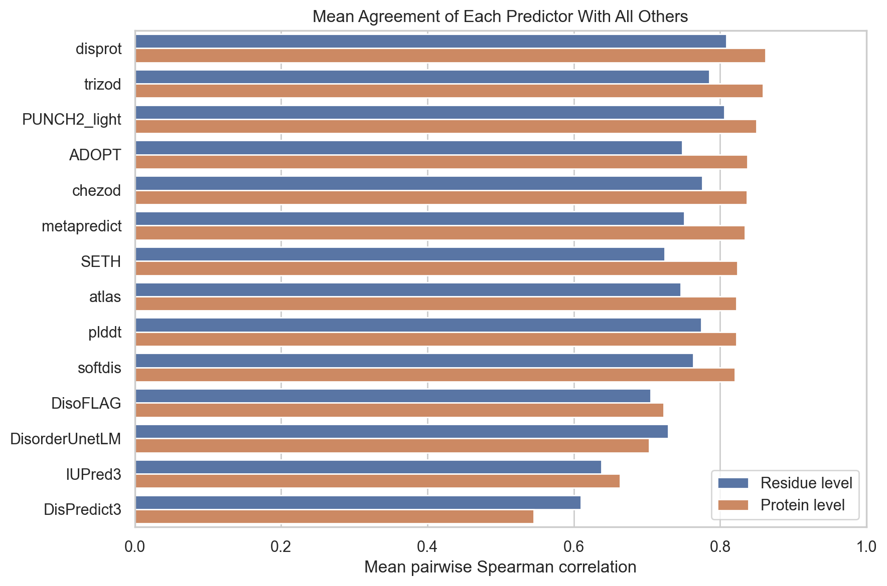

*Figure 2. Mean pairwise Spearman correlation of each predictor with the other 13 methods. This measures centrality within the predictor panel, not accuracy against experimental truth.*

### 5.1 Central consensus predictors

DisProt-UdonPred, TriZOD-UdonPred, and PUNCH2-light have the highest mean residue-level agreement with the rest of the panel. Several predictors, including ADOPT, CheZOD-UdonPred, metapredict, SETH, ATLAS, pLDDT, and SoftDis, show high protein-level agreement.

Their central position has interpretable causes:

- **metapredict** is explicitly trained to approximate consensus disorder, so high centrality is expected.
- **SETH and ADOPT** share NMR/CheZOD-related targets with the strongest UdonPred pair.
- **PUNCH2-light** combines modern embeddings with a conventional binary disorder objective and therefore captures signals shared across several families.
- **DisProt-UdonPred** learns curated disorder regions and is close to several methods developed or evaluated on DisProt-derived benchmarks.

### 5.2 Independence is not equivalent to inferiority

IUPred3 and DisPredict3 have the lowest mean agreement, but for different reasons.

IUPred3 is based on estimated interaction energies rather than a supervised pLM model trained to imitate one of the current annotation sets. Its relative independence is therefore consistent with its design. It may respond differently to unusual charge/hydrophobicity combinations, context-dependent folding, coiled coils, or segments that are difficult to classify from benchmark labels.

DisPredict3 is a supervised modern method, but it combines pLM and engineered features with a tree-based classifier optimized for a binary DisProt-derived task. Its output can be highly accurate on a matching benchmark while remaining conservative and non-consensus across an unlabelled proteome.

Mean agreement should therefore be interpreted as **panel centrality**. It answers “How typical is this predictor relative to the others?” It does not answer “Which predictor is correct?”

---

## 6. Hierarchical Clustering

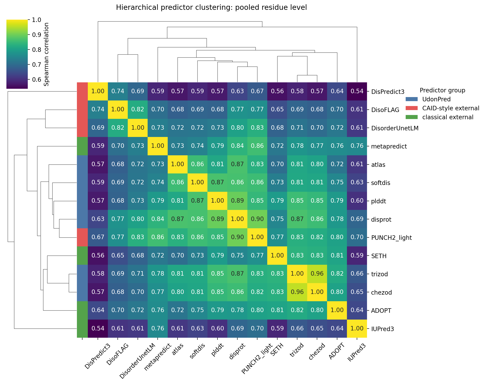

*Figure 3. Average-linkage hierarchical clustering using distance `1 - residue Spearman`. Side colors mark UdonPred, CAID-style external, and classical external predictors.*

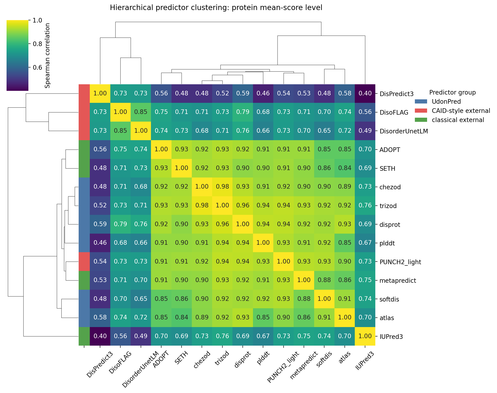

*Figure 4. The same clustering procedure applied to protein mean-score Spearman.*

### 6.1 Stable subgroup: DisPredict3, DisoFLAG, and DisorderUnetLM

The three predictors are adjacent at both analysis levels. Their relationship remains visible after switching from residue localization to whole-protein ranking. This suggests a shared emphasis rather than a single plotting artifact.

Possible shared factors include:

- modern protein-language-model inputs;
- binary disorder targets closely connected to DisProt/CAID-style evaluation;
- strong nonlinear segmentation/classification behavior;
- training objectives that emphasize discriminating confident positives and negatives rather than reproducing a continuous structural scale.

Their agreement is still incomplete. DisoFLAG additionally uses functional multi-task information, DisorderUnetLM uses a multiscale Attention U-Net, and DisPredict3 uses PCA plus LightGBM and engineered features. The subgroup therefore represents related outputs, not equivalent algorithms.

### 6.2 The UdonPred family forms a dense core, but target type changes local neighbors

TriZOD and CheZOD are nearly inseparable. pLDDT, DisProt, SoftDis, and ATLAS remain broadly connected but attach at different locations. This is consistent with a common ProstT5 representation learning a shared base signal, followed by target-specific heads emphasizing different aspects of that representation.

The main methodological lesson is that shared architecture increases agreement but does not erase annotation ontology. A model trained to reproduce low AlphaFold confidence is not identical to a model trained on curated functional disorder, even when both use the same embeddings and network layers.

### 6.3 Classical predictors do not form one uniform group

The “classical external” label is a descriptive category rather than a coherent cluster. metapredict joins the broad consensus core, SETH and ADOPT are close to NMR-related models, and IUPred3 remains more isolated. This reinforces that grouping by publication era or external/internal status is less informative than grouping by training objective and representation.

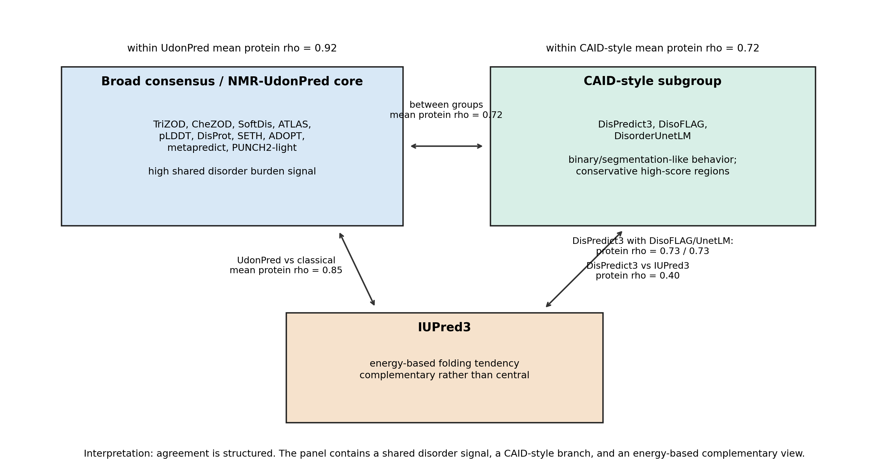

*Supplementary Figure A. Simplified map of the main predictor relationships. The diagram compresses the heatmaps and clustering into three interpretive groups: a broad consensus/NMR-UdonPred core, a CAID-style subgroup, and the complementary energy-based IUPred3 view.*

The simplified map is useful for reading the rest of the report. The UdonPred-centered consensus and the CAID-style subgroup are not disconnected; their mean protein-level agreement is still positive and substantial. The important point is that the relationships are **structured**: DisPredict3 is not equally distant from all methods, and IUPred3 is independent for a different methodological reason.

---

## 7. Extreme Protein Rankings

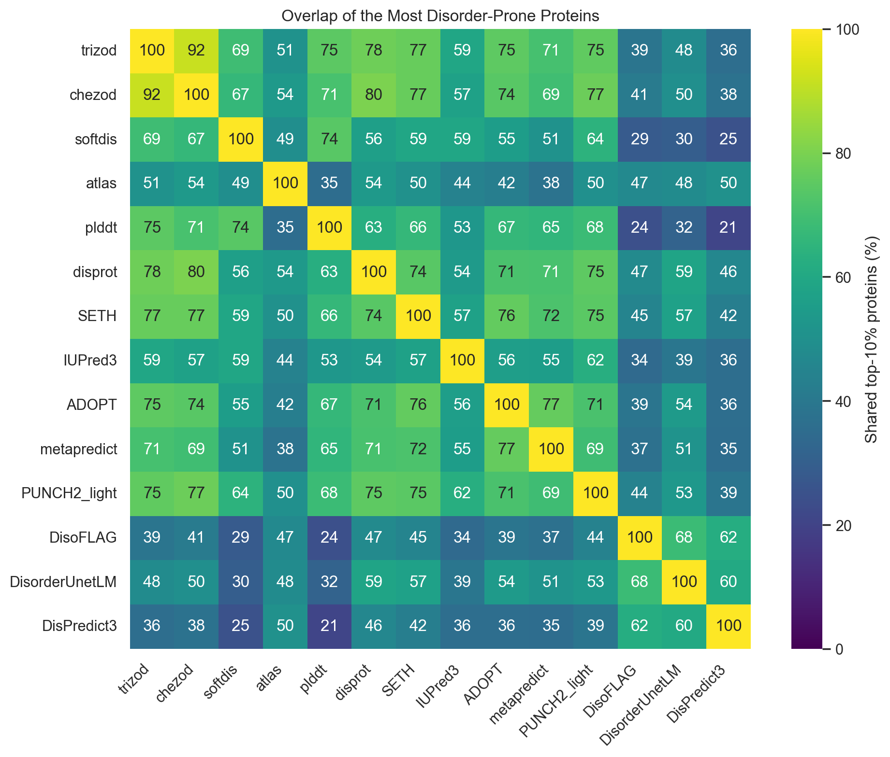

*Figure 5. Percentage overlap between each predictor's top 10% most disorder-prone proteins. High correlation does not guarantee identical selection of extreme proteins.*

### 7.1 The consensus core agrees strongly about extreme proteins

TriZOD and CheZOD share approximately 92% of their top-decile proteins. Several consensus-group pairs share 70-80%. These values are much higher than the 10% overlap expected from two independent top-decile selections, demonstrating strong agreement about the most disorder-rich proteins.

### 7.2 DisPredict3 chooses a different extreme set

DisPredict3 shares:

- approximately 62% of its top set with DisoFLAG;
- approximately 60% with DisorderUnetLM;
- approximately 50% with ATLAS;
- mostly 21-46% with the remaining predictors.

Its particularly low overlap with pLDDT and SoftDis shows that the disagreement is not just a smooth monotonic rescaling. Spearman correlation can remain moderate when many ranks are similar, but top-decile overlap reveals that the most strongly prioritized proteins differ substantially.

### 7.3 Why top-decile disagreement matters biologically

Proteins selected for follow-up experiments are often chosen from the extremes. Two predictors with acceptable global correlation may therefore lead to different biological candidate lists. For applications such as identifying highly disordered regulatory proteins, phase-separation candidates, or proteins rich in flexible interaction regions, the extreme-set comparison is more operationally relevant than a single global correlation coefficient.

The top-decile results support a practical recommendation: candidate selection should use an ensemble or explicitly report sensitivity to predictor choice. A protein selected only by DisPredict3 represents a different type of hypothesis from a protein selected by the UdonPred/SETH/metapredict consensus.

---

## 8. Why DisPredict3 Looks Different

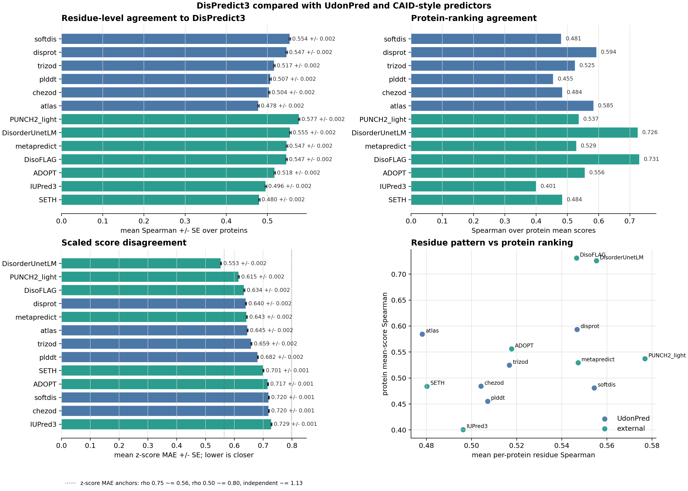

*Figure 6. Focused DisPredict3 diagnostics. The panels separate mean within-protein residue agreement, protein-ranking agreement, standardized score disagreement, and the relationship between local and global agreement.*

### 8.1 Local pattern similarity and protein ranking are separate properties

Mean within-protein residue Spearman values against DisPredict3 are relatively compressed, mostly around 0.48-0.58. Protein-ranking agreement varies much more strongly, from approximately 0.40 for IUPred3 to approximately 0.73 for DisoFLAG and DisorderUnetLM.

This means some predictors recognize similar local high/low patterns inside a protein but assign a different overall baseline to that protein. Conversely, DisoFLAG and DisorderUnetLM not only reproduce part of the local pattern but also rank whole proteins similarly to DisPredict3.

The result explains why one summary statistic is insufficient. DisPredict3's difference is partly a **protein-level calibration/ranking effect**, not only a residue-boundary effect.

### 8.2 DisPredict3 has a conservative score distribution

Across approximately 11.19 million residues, DisPredict3 has:

- mean score: approximately **0.092**;
- median score: approximately **0.006**;
- 95th percentile: approximately **0.62**;
- protein mean-score average: approximately **0.153**.

The median near zero means that at least half the residues receive almost no disorder propensity, while a smaller subset receives high values. This is a sparse or conservative profile compared with predictors whose scores are more broadly distributed.

Such a distribution is consistent with a binary classifier optimized under class imbalance and with a tree-based decision model. It can achieve strong ranking or classification performance on benchmark positives while assigning low scores to much of the background proteome.

### 8.3 Raw score scales cannot explain the rank disagreement

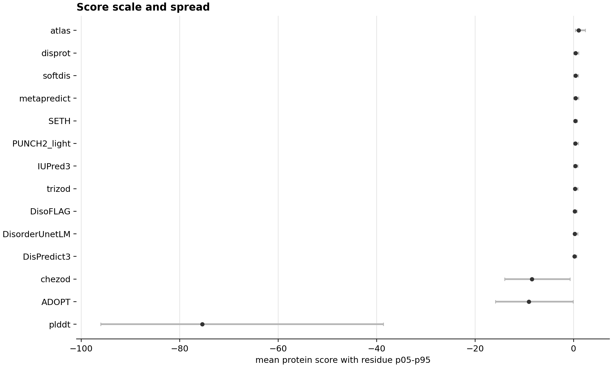

*Figure 7. Native oriented score scales. CheZOD, ADOPT, and pLDDT use numerically different ranges from probability-like predictors. The figure demonstrates why raw MAE or a shared threshold would be misleading.*

Differences in raw scale explain why absolute score subtraction is inappropriate, but they do not explain low Spearman correlation because Spearman is invariant under monotonic transformations. The remaining rank disagreement must therefore reflect genuine differences in which residues or proteins receive the strongest values.

This distinction is important:

- **scale difference**: same ranking, different numeric range;
- **calibration difference**: similar ranking, different probability interpretation or baseline;
- **rank difference**: different biological prioritization.

DisPredict3 exhibits all three relative to different comparison methods, but the low protein-level Spearman and top-decile overlap prove that rank difference is substantial.

### 8.4 High-score residue sets confirm a different segmentation

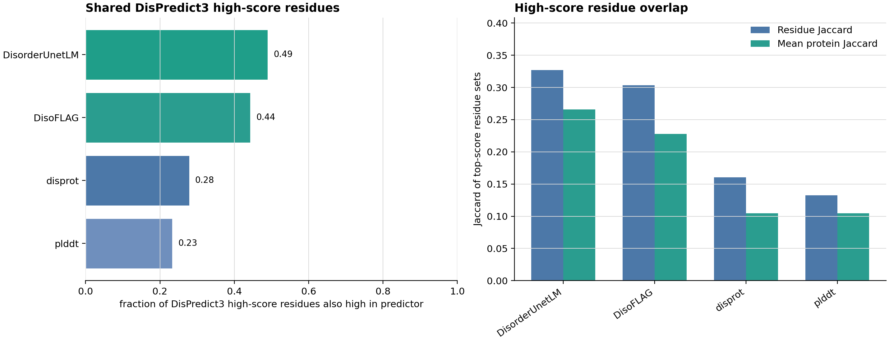

*Figure 8. Overlap of within-predictor top-decile residue sets. The left panel asks what fraction of DisPredict3-high residues are also high in another predictor. The right panel reports residue-level and mean per-protein Jaccard overlap.*

Among the focused comparisons:

- DisorderUnetLM recovers approximately **49%** of DisPredict3's high-score residues.
- DisoFLAG recovers approximately **44%**.
- DisProt-UdonPred recovers approximately **28%**.
- pLDDT-UdonPred recovers approximately **23%**.

Residue-set Jaccard values are about 0.33 for DisorderUnetLM, 0.30 for DisoFLAG, 0.16 for DisProt, and 0.13 for pLDDT. Thus, even after each predictor is allowed its own top-decile threshold, large portions of the strongest predicted regions do not coincide.

This is strong evidence that DisPredict3's distinctness is not an artifact of choosing 0.5 or of using incompatible output scales. It identifies a genuinely different subset of residues as most disorder-like.

### 8.5 Concrete protein examples

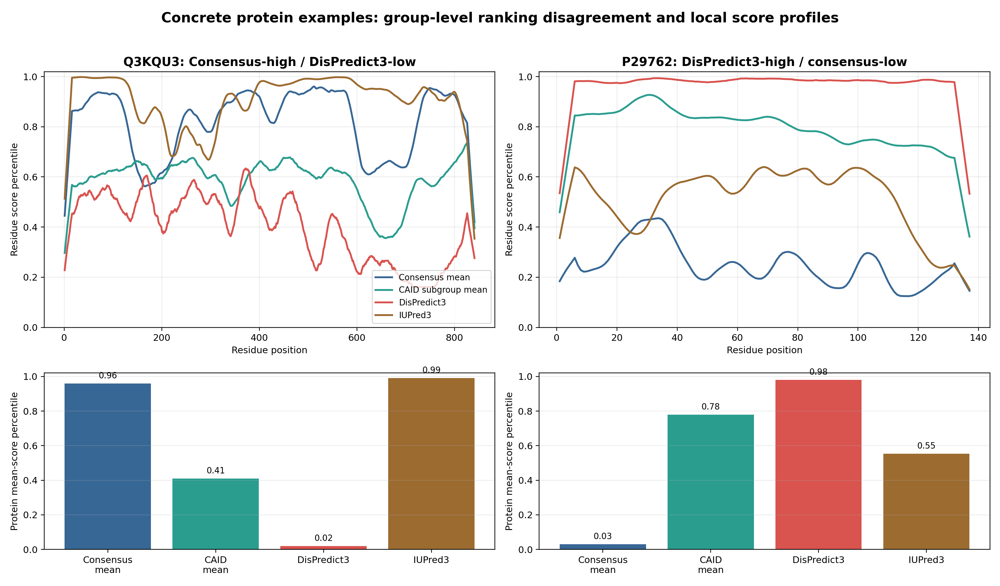

*Supplementary Figure B. Two proteins selected from the common predictor intersection to illustrate how the global patterns appear at sequence level. Residue curves show smoothed within-predictor score percentiles, so all predictors are compared on rank-normalized scales. Bars show each protein's mean-score percentile within each predictor or predictor group.*

The two examples show why both protein-level and residue-level views are needed:

- **Q3KQU3** is ranked highly by the consensus group but very low by DisPredict3. Its local consensus profile stays high over much of the sequence, while DisPredict3 assigns lower relative residue percentiles. This is the practical form of a consensus-high / DisPredict3-low disagreement.
- **P29762** shows the opposite pattern. DisPredict3 assigns a near-top protein-level percentile and high residue percentiles across most of the sequence, while the consensus group ranks the protein very low. This is the kind of case where a DisPredict3-driven candidate list would differ strongly from a consensus-driven list.

These examples are not presented as ground truth cases. They are diagnostic examples: they make visible how differences in target definition, calibration, and segmentation can change the biological hypothesis generated from the same protein sequence.

### 8.6 Why strong CAID performance does not imply consensus behavior

DisPredict3 was designed and evaluated for benchmark discrimination, including CAID Disorder-NOX. Several factors separate this task from the present comparison:

1. **Different target:** CAID evaluates against a defined reference annotation, not against the average output of other predictors.
2. **Different sequence distribution:** the human proteome contains long, multidomain, membrane, secreted, repetitive, and poorly characterized proteins that may be underrepresented in benchmark sets.
3. **Different metric:** AUROC, average precision, F1, MCC, or thresholded classification emphasize different behavior than full-proteome Spearman correlation.
4. **Class imbalance:** a conservative predictor can perform well by sharply separating a smaller positive subset while giving most residues low scores.
5. **Annotation compatibility:** performance is highest when a predictor's learned target resembles the benchmark's operational definition of disorder.

Therefore, the correct interpretation is:

> DisPredict3 may be highly effective for the benchmark target while remaining systematically different from predictors trained on continuous NMR, structural confidence, consensus, or alternative disorder annotations.

Its low agreement is scientifically interesting because it exposes the non-equivalence of disorder definitions. It is not evidence that the method failed.

---

## 9. Protein-Length Effects

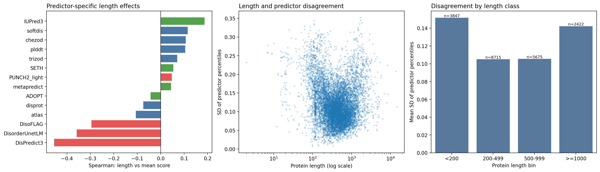

*Figure 9. Left: Spearman relationship between protein length and mean score for each predictor. Center: protein length versus cross-predictor disagreement. Right: mean disagreement by length class.*

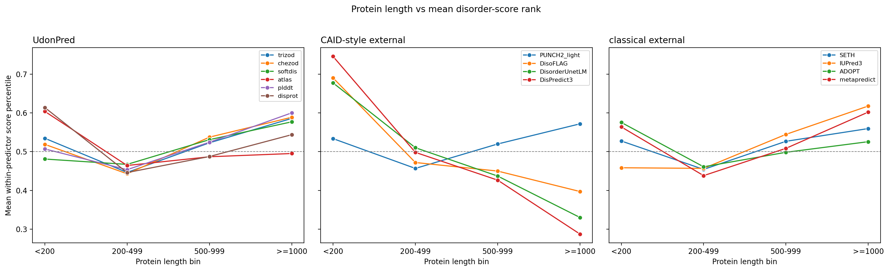

*Figure 10. Mean within-predictor protein-score percentile across length classes. Percentiles make predictors with different native score scales comparable.*

### 9.1 Disagreement is U-shaped across protein length

All length classes are well represented:

| Length class | Proteins | Mean cross-predictor disagreement |
|---|---:|---:|
| <200 residues | 3,847 | 0.152 |
| 200-499 residues | 8,715 | 0.105 |
| 500-999 residues | 5,675 | 0.105 |
| >=1,000 residues | 2,422 | 0.142 |

Very short and very long proteins show the greatest disagreement.

### 9.2 Why short proteins are difficult

Short proteins can be dominated by signal peptides, transmembrane helices, targeting peptides, short domains, or low-complexity segments. A small number of residues strongly changes the protein mean. Short sequences also provide less context for models using recurrent, convolutional, attention, or language-model representations.

Different predictors may interpret the same short hydrophobic or low-complexity sequence as a signal peptide, a membrane segment, a compact domain, or disorder. The resulting uncertainty is magnified when the entire protein contains only a few dozen residues.

### 9.3 Why long proteins are difficult

Long human proteins often combine multiple folded domains, long linkers, repeats, coiled coils, low-complexity regions, and termini with different structural states. Their global mean depends on how a method balances many heterogeneous segments.

Long proteins also expose technical constraints. ADOPT is truncated for 2,317 sequences in the current output, preventing a full-length comparison. Even without truncation, architecture-specific receptive fields and smoothing can affect whether a long disordered segment is treated as one coherent region or a collection of local signals.

### 9.4 Predictor-specific length biases

The strongest negative relationships between protein length and mean score occur for:

- DisPredict3: Spearman approximately **-0.455**;
- DisorderUnetLM: approximately **-0.358**;
- DisoFLAG: approximately **-0.296**.

IUPred3 has the strongest positive relationship, approximately **+0.187**. Most UdonPred models and consensus-group predictors have weaker relationships.

This shared negative length trend helps explain why DisPredict3, DisoFLAG, and DisorderUnetLM cluster together at protein level. They systematically deprioritize long proteins relative to the main consensus. Because human regulatory and scaffold proteins can be long and rich in mixed structured/disordered architecture, this effect changes which proteins enter the top disorder-ranked set.

The data establish the length association but do not prove a single cause. Plausible contributors are training-set length distributions, crystallographic label bias, output pooling, class imbalance, receptive-field behavior, and different treatment of mixed-domain proteins.

---

## 10. Training Annotation and Learned Behavior

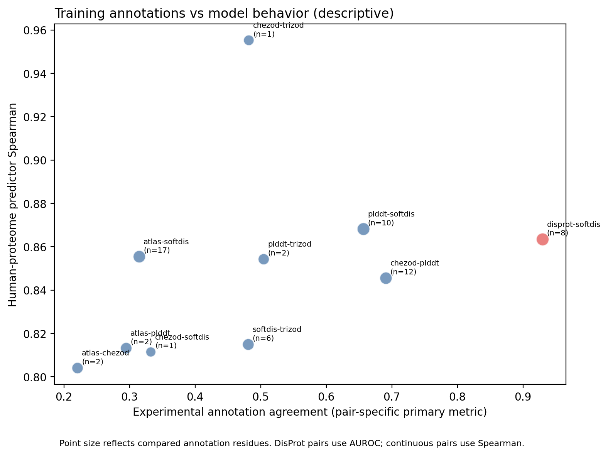

*Figure 11. Agreement between UdonPred training annotations compared with agreement between the corresponding human-proteome model outputs. Point size reflects the number of annotation residues compared. Continuous pairs use Spearman; the available DisProt pair uses AUROC.*

### 10.1 Descriptive relationship

For the nine UdonPred pairs with continuous annotation Spearman values, annotation agreement and human-proteome model agreement have a descriptive Spearman correlation of approximately **0.60**. Including the one available DisProt primary-metric pair gives approximately **0.64**.

The positive direction is consistent with the hypothesis that similar experimental annotations produce more similar models. This is also supported by the particularly high TriZOD-CheZOD model agreement.

### 10.2 Why the relationship cannot be treated as a formal causal result

The annotation overlap is sparse. Several points are based on only one or two overlapping proteins, and the pairs are statistically dependent because each dataset appears multiple times. DisProt pairs use AUROC while continuous pairs use Spearman. The annotation comparison also uses only overlapping experimental residues, whereas predictor agreement uses millions of residues across the full human proteome.

The figure is therefore a mechanistic diagnostic, not a significance test. It supports, but does not prove, the following causal chain:

> experimental definition -> target distribution -> learned decision function -> proteome-wide predictor behavior

The controlled UdonPred architecture makes this interpretation more credible, but a definitive test would require retraining models under matched sample sizes and controlled label transformations.

### 10.3 What the UdonPred comparison reveals biologically

The imperfect agreement among UdonPred targets shows that the following concepts overlap but are not interchangeable:

- continuous local flexibility;
- NMR deviation from ordered reference behavior;
- curated functional disorder;
- structural variability;
- absence of a stable crystallographic observation;
- low confidence in a predicted structure.

This is the central biological explanation for why “disorder predictors” disagree. The label *disorder* is being used for a family of related structural phenomena, not one universally observed scalar variable.

---

## 11. Detailed Causes of Predictor Disagreement

### 11.1 Cause 1: different disorder ontologies

The largest conceptual source of disagreement is the definition of a positive residue. NMR-derived continuous disorder, curated binary disorder, missing electron density, and low structure-prediction confidence can coincide, but none is a perfect substitute for another.

Expected consequences include:

- conditional folding regions may be curated as disordered but appear structurally confident in a particular context;
- flexible loops may have low confidence without being long intrinsically disordered regions;
- crystal missing residues may preferentially represent termini and mobile loops;
- NMR scores may resolve intermediate states that binary labels discard.

### 11.2 Cause 2: continuous regression versus binary classification

Continuous models learn relative degree and can assign meaningful intermediate values. Binary models are optimized to separate two classes and may produce sharper or more conservative outputs. Threshold optimization under imbalance further encourages a decision-oriented score distribution.

This helps explain why TriZOD, CheZOD, SETH, and ADOPT agree strongly on broad rankings, while DisPredict3 produces a median near zero and emphasizes a smaller positive subset.

### 11.3 Cause 3: model representation and architecture

Different architectures integrate context differently:

- recurrent networks summarize sequential context;
- CNNs emphasize local motifs and depend on receptive field;
- Attention U-Nets combine multiscale features and segmentation-like localization;
- transformers encode long-range context through pretraining;
- LightGBM creates piecewise decision boundaries from engineered and embedded features;
- graph multi-task models couple disorder with binding and linker functions;
- energy models calculate a physically motivated folding tendency rather than learning benchmark labels directly.

Protein language models reduce disagreement by encoding shared evolutionary and structural patterns, but they do not determine the final target. The supervised objective decides which parts of the embedding space become important.

### 11.4 Cause 4: training-set composition

Training datasets differ in organism distribution, protein length, redundancy filtering, experimental technique, positive-region length, and prevalence of terminal versus internal disorder. PUNCH2's authors explicitly note bias from X-ray-derived missing-residue annotations toward shorter terminal IDRs and fully disordered proteins. DisPredict3 uses a relatively small DisProt-derived training collection compared with the millions of sequences used to pretrain its protein language model.

Pretraining provides broad sequence knowledge, but supervised labels determine how that knowledge is converted into disorder scores. A large pLM therefore does not eliminate annotation bias.

### 11.5 Cause 5: score calibration and dynamic range

Some predictors spread scores across most of their allowed range; others place most residues near one extreme. These differences affect thresholds, predicted disorder fractions, and protein averages.

Spearman correlation reduces but does not eliminate consequences of calibration. If a method compresses many residues into ties near zero, fine-grained ranks are lost. Protein means then become sensitive to the small number of high-scoring segments.

### 11.6 Cause 6: local boundaries, smoothing, and context

Two predictors can recognize the same broad region but disagree by 10-20 residues at its boundaries. Repeated across the proteome, boundary shifts reduce residue-level correlation while leaving protein means similar.

Gaussian smoothing, convolutional receptive fields, segmentation architectures, and post-processing can all change transition sharpness. Short disorder is particularly sensitive: SETH's authors reported weaker behavior for short disordered segments than for long disorder, illustrating how region length interacts with the learned target.

### 11.7 Cause 7: protein length and mixed architecture

The observed U-shaped disagreement and subgroup-specific length trends demonstrate that proteome composition is not a neutral background. A benchmark enriched for shorter, experimentally characterized proteins can favor a different behavior from a whole human proteome containing very long multidomain proteins.

### 11.8 Cause 8: benchmark metric and benchmark domain

AUROC rewards ranking positives above negatives over all possible thresholds. Average precision is sensitive to class imbalance. F1 and MCC depend on thresholded predictions. Spearman evaluates continuous ranks. Top-decile overlap evaluates extreme candidate identity.

A predictor can improve one metric while moving away from consensus under another. Statements such as “best predictor” are incomplete unless they specify the dataset, reference definition, metric, and intended biological use.

### 11.9 Cause 9: genuine biological ambiguity

Some residues are conditionally folded, become ordered upon binding, form transient helices, participate in coiled coils, or lie in low-complexity regions that are not necessarily disordered under every condition. In such cases predictor disagreement may reflect uncertainty in the biological state rather than algorithmic failure.

---

## 12. Technical Quality Control and Potential Artifacts

### 12.1 Sequence and length matching

The key DisPredict3 comparisons against pLDDT, DisProt, DisoFLAG, and DisorderUnetLM contain no length or sequence mismatch among shared proteins. Therefore the focused DisPredict3 subgroup result is not explained by shifted residue indices.

Two issues remain for the full panel:

- **ADOPT truncation:** 2,317 proteins are shorter than the reference prediction. Protein means represent only the retained prefix for these sequences.
- **metapredict sequence mismatch:** 67 proteins differ from the reference sequence and should be excluded from residue-position case studies unless realigned.

### 12.2 Unequal protein coverage

PUNCH2-light and DisoFLAG omit several hundred proteins, and DisPredict3 omits 63. Pairwise statistics therefore operate on slightly different protein sets. This is unlikely to create the broad clustering pattern by itself, but it can affect exact top-decile membership and should be reported.

### 12.3 Long-protein weighting

Pooled residue-level statistics weight long proteins more strongly. Protein-level statistics give each protein equal weight. The two are not redundant and should always be shown together.

### 12.4 Non-independence of predictors

Several methods share training resources, protein-language-model families, DisProt-derived annotations, or consensus inputs. Treating the 14 predictors as 14 statistically independent biological measurements would be incorrect. High agreement partly reflects shared information ancestry.

### 12.5 Absence of ground truth in the human-proteome comparison

The comparison measures consistency, not accuracy. Without matched experimental labels across the full proteome, it cannot determine which predictor is correct in a disagreement region. Experimental benchmark performance must be analyzed separately.

---

## 13. Integrated Interpretation

### 13.1 Do the predictors learn a shared disorder signal?

Yes. Predominantly positive and often high correlations, strong consensus-group top-decile overlaps, and dense clustering among models with different architectures demonstrate a substantial common signal.

### 13.2 Do they learn exactly the same biological property?

No. The stable DisPredict3/DisoFLAG/DisorderUnetLM subgroup, IUPred3's independence, target-specific UdonPred differences, low high-score residue Jaccards, and length-specific behavior show systematic non-equivalence.

### 13.3 Which factors are most strongly supported by the data?

The evidence can be ranked as follows:

1. **Strong evidence: annotation target matters.** UdonPred controls much of the architecture while changing targets, yet produces measurable differences.
2. **Strong evidence: DisPredict3's difference is not only scale.** Rank correlations and quantile-based overlaps remain distinct.
3. **Strong evidence: protein length contributes.** Disagreement is U-shaped, and the CAID-style subgroup shares negative length trends.
4. **Strong evidence: local and global agreement differ.** Protein-level and residue-level matrices show different structures.
5. **Moderate evidence: architecture and objective create subgroups.** Clusters match several methodological similarities, but architecture is confounded with training data.
6. **Suggestive evidence: experimental annotation similarity predicts model similarity.** The direction is positive, but annotation overlaps are small.

### 13.4 Why DisPredict3 is scientifically valuable in the panel

DisPredict3 provides a counterpoint to the central consensus. Its behavior shows that a high-performing benchmark model can prioritize a narrower or different disorder concept. Rather than removing it as an outlier, it should be used to identify proteins and residues where the biological conclusion depends most strongly on the chosen operational definition.

The strongest hypotheses are generated where:

- DisPredict3, DisoFLAG, and DisorderUnetLM agree but the main consensus does not;
- the UdonPred/SETH/ADOPT consensus agrees but DisPredict3 remains low;
- IUPred3 alone predicts high disorder, suggesting an energy-based signal absent from learned labels;
- pLDDT suggests uncertainty but curated/NMR predictors do not, suggesting model uncertainty rather than intrinsic disorder;
- agreement changes strongly with protein length.

---

## 14. Practical Recommendations

### 14.1 For global proteome conclusions

Report at least one residue-level and one protein-level metric. Do not report a single pooled correlation as complete evidence of agreement.

### 14.2 For candidate selection

Use predictor ensembles or stratify candidates into:

- consensus-high;
- consensus-low;
- CAID-style-subgroup-high;
- NMR/UdonPred-high;
- method-specific outliers.

This preserves disagreement as information instead of hiding it in an average.

### 14.3 For score thresholds

Use predictor-specific validated thresholds for classification. For exploratory cross-predictor comparison, use ranks or quantiles. Do not assume that 0.5 has the same meaning for all models.

### 14.4 For long proteins

Inspect coverage and truncation before interpreting protein means. Where possible, compare full-length profiles and domain-aware summaries rather than one global average.

### 14.5 For biological interpretation

Match the predictor to the question:

- NMR-like continuous dynamics: TriZOD, CheZOD, SETH, or ADOPT-like outputs may be most directly relevant.
- curated binary disorder: DisProt-trained or CAID-oriented models are conceptually closer.
- structure-confidence proxy: pLDDT-based behavior should be described as confidence-related, not automatically as experimental disorder.
- physical folding tendency: IUPred3 offers a complementary energy-based view.

### 14.6 For claims about accuracy

Use an independent experimental benchmark with a clearly specified annotation definition. Consensus is not a substitute for truth, and benchmark rank is not a substitute for proteome-wide behavioral analysis.

---

## 15. Limitations and Next Analyses

The present analysis is extensive but not causal. The following extensions would strengthen the explanation:

1. **Matched retraining experiment:** train identical architectures on label sets standardized to the same scale and sample size.
2. **Domain-stratified analysis:** separate globular domains, coiled coils, transmembrane regions, signal peptides, low complexity, and annotated IDRs.
3. **Protein-function enrichment:** test whether disagreement proteins are enriched for transcription, RNA binding, signaling, phase separation, or membrane localization.
4. **Calibration analysis:** compare reliability curves on a common independent experimental dataset.
5. **Length-matched resampling:** verify subgroup differences after predictors are compared on identical length distributions.
6. **Residue-level case studies:** inspect representative proteins from each disagreement category with domain and experimental annotations.
7. **Consensus robustness:** repeat candidate selection using median ranks, majority voting, and subgroup-specific ensembles.

These analyses would distinguish whether a disagreement is driven mainly by annotation ontology, sequence class, architecture, or biological context.

---

## 16. Conclusions

The human-proteome comparison demonstrates that modern disorder predictors share a substantial common signal but do not estimate one universal disorder variable. The highest agreement occurs among UdonPred models and several NMR/consensus-related external predictors. DisPredict3, DisoFLAG, and DisorderUnetLM form a reproducible subgroup, while IUPred3 contributes a comparatively independent energy-based perspective.

DisPredict3's lower average agreement is explained by a combination of conservative score distribution, different whole-protein ranking, distinct high-score residue selection, strong negative protein-length association, binary benchmark-oriented training, and a model architecture that differs from the central continuous-regression group. None of these findings contradicts strong CAID performance, because CAID accuracy and predictor-consensus agreement answer different questions.

The comparison of UdonPred targets provides the clearest general lesson: even when protein representation and model architecture are largely held constant, changing the training annotation changes the learned proteome-wide behavior. Disorder prediction is therefore inseparable from the definition of disorder used as ground truth.

The scientifically appropriate conclusion is not that one predictor is universally best. Instead:

> The predictors agree on a common core of intrinsic disorder, but their systematic differences reveal distinct experimental definitions, modeling assumptions, and biological sensitivities. Those differences should be reported, interpreted, and used to generate targeted hypotheses rather than averaged away.

---

## References

1. Schlensok J, Wagemann D, Senoner T, Haak M, Rost B. [UdonPred: Untangling Protein Intrinsic Disorder Prediction](https://doi.org/10.64898/2026.01.26.701679). bioRxiv, 2026.
2. Ilzhoefer D et al. [SETH predicts nuances of residue disorder from protein embeddings](https://pmc.ncbi.nlm.nih.gov/articles/PMC9580958/). *Frontiers in Bioinformatics*, 2022.
3. Sormanni P et al. [ADOPT: intrinsic protein disorder prediction through deep bidirectional transformers](https://pmc.ncbi.nlm.nih.gov/articles/PMC10150328/). *Nucleic Acids Research*, 2023.
4. Emenecker RJ et al. [Metapredict: a fast, accurate, and easy-to-use predictor of consensus disorder and structure](https://doi.org/10.1016/j.bpj.2021.08.039). *Biophysical Journal*, 2021.
5. Erdős G et al. [IUPred3: prediction of protein disorder enhanced with unambiguous experimental annotation and visualization of evolutionary conservation](https://pmc.ncbi.nlm.nih.gov/articles/PMC8262696/). *Nucleic Acids Research*, 2021.
6. Meng D, Pollastri G. [PUNCH2: Explore the strategy for intrinsically disordered protein predictor](https://pmc.ncbi.nlm.nih.gov/articles/PMC11940444/). *PLOS ONE*, 2025.
7. Pang Y et al. [DisoFLAG: accurate prediction of protein intrinsic disorder and its functions using graph-based interaction protein language model](https://pubmed.ncbi.nlm.nih.gov/38166858/). *Briefings in Bioinformatics*, 2024.
8. Pulikanty S et al. [DisorderUnetLM: Validating ProteinUnet for efficient protein intrinsic disorder prediction](https://doi.org/10.1016/j.compbiomed.2024.109586). *Computers in Biology and Medicine*, 2025.
9. Iqbal S et al. [DisPredict3.0: Prediction of intrinsically disordered regions/proteins using protein language model](https://doi.org/10.1016/j.amc.2024.128630). *Applied Mathematics and Computation*, 2024.
10. Dass R et al. [ODiNPred: comprehensive prediction of protein order and disorder](https://pmc.ncbi.nlm.nih.gov/articles/PMC7479119/). *Scientific Reports*, 2020.

---

## Reproducibility

The analysis is generated from the following repository components:

- `scripts/compare_predictors.py`
- `scripts/analyze_dispredict3_vs_udonpred.py`
- `scripts/diagnose_dispredict3_disagreements.py`
- `scripts/analyze_global_predictor_behavior.py`
- `scripts/plot_predictor_report_supplements.py`
- `notebooks/05_predictor_agreement.ipynb`

Principal result tables are stored under:

- `results/compare_predictors_with_all_predictors_wo_pdbflex/`
- `results/compare_predictors_with_all_predictors_wo_pdbflex/global_behavior/`
- `results/dispredict3_disagreement_diagnostics_key_predictors/`

All numerical interpretations in this report are derived from those local result files. Literature-derived explanations are explicitly connected to the cited primary publications.

Regenerate the illustrated PDF with `UdonPred/.venv/bin/python scripts/render_predictor_report_pdf.py`.
