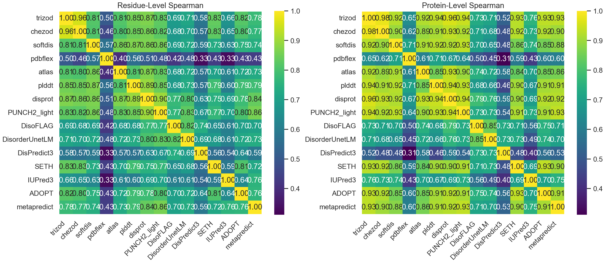
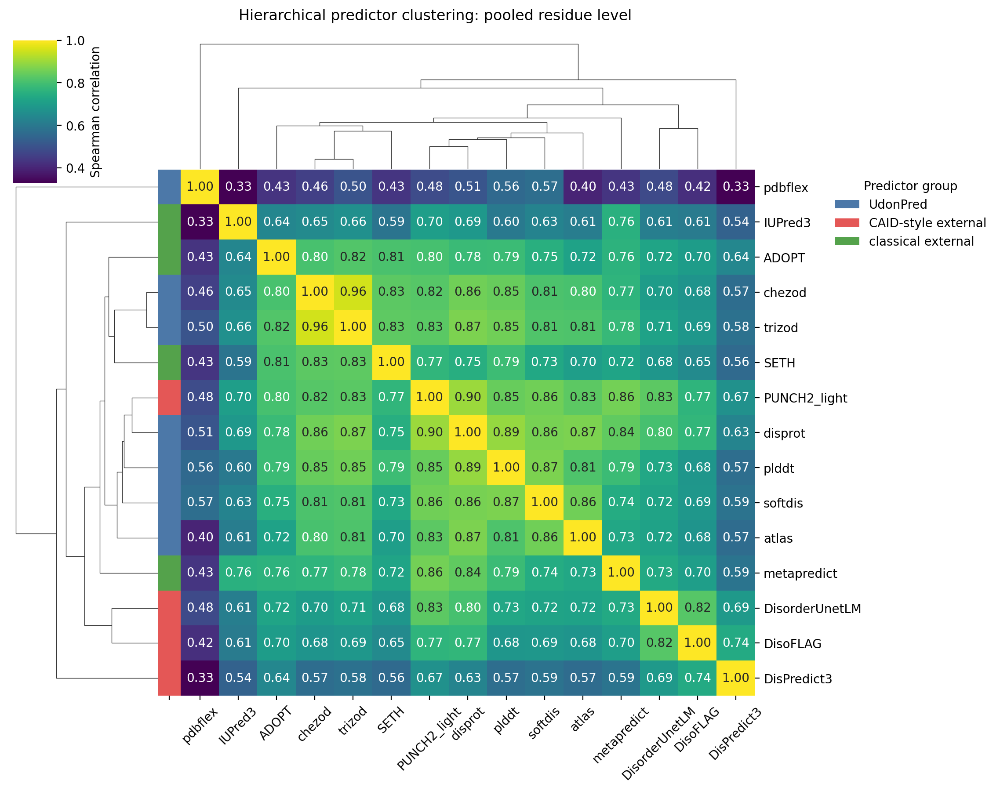
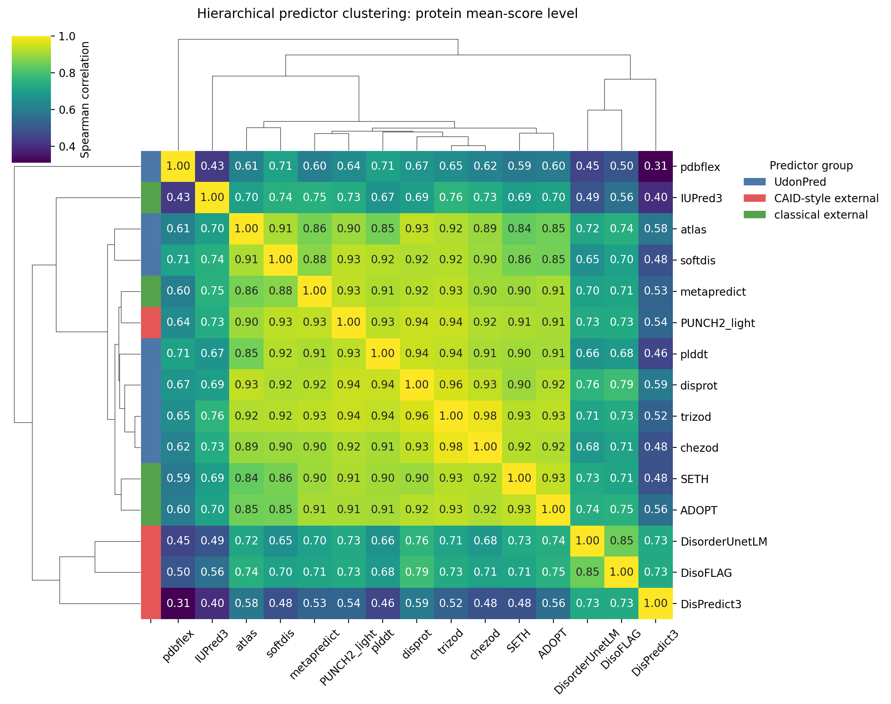
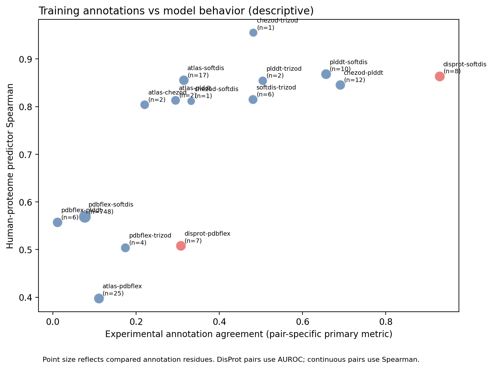
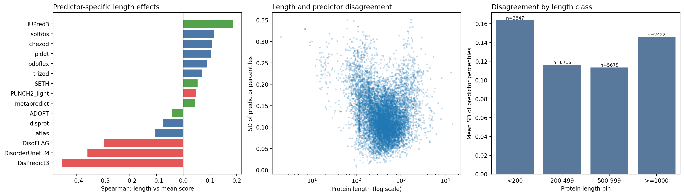
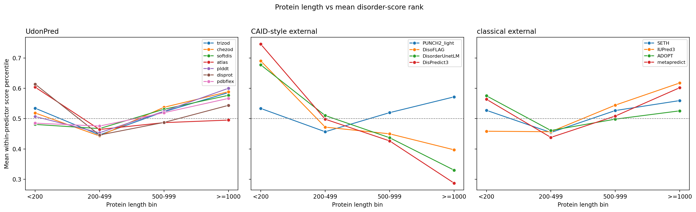

# Global Comparison of Protein Intrinsic Disorder Predictors Including PDBflex

## How a structural-flexibility target changes the predictor landscape

**Data scope:** 15 predictor outputs, up to 20,659 human proteins and approximately 11.46 million residues  
**Special focus:** PDBflex-UdonPred compared with six other UdonPred targets and eight external predictors  
**Interpretive goal:** distinguish structural flexibility, missing-density-related signals, model uncertainty, and intrinsic disorder

---

## Contents

1. [Summary](#1-summary)
2. [Why PDBflex Is a Distinct Target](#2-why-pdbflex-is-a-distinct-target)
3. [Methods](#3-methods)
4. [Global Agreement Including PDBflex](#4-global-agreement-including-pdbflex)
5. [Hierarchical Clustering](#5-hierarchical-clustering)
6. [Annotation-Level Evidence](#6-annotation-level-evidence)
7. [Protein-Length Effects](#7-protein-length-effects)
8. [Why PDBflex Differs](#8-why-pdbflex-differs)
9. [Consequences for the Other Predictors](#9-consequences-for-the-other-predictors)
10. [Limitations and Conclusions](#10-limitations-and-conclusions)

---

## 1. Summary

This report extends the 14-predictor human-proteome comparison by adding the UdonPred model trained on PDBflex. PDBflex is not simply another binary intrinsic-disorder annotation. It represents flexibility inferred from ensembles of experimentally determined structures and therefore captures conformational variability in proteins that are sufficiently structured to be observed in the Protein Data Bank. Flexible structured loops, hinge regions, domain movements, termini, unresolved segments, and intrinsically disordered regions can overlap, but they are not equivalent biological categories.

PDBflex is available for all 20,659 reference proteins and has exact sequence and length agreement with the TriZOD reference outputs. Its distinct behavior is therefore not caused by missing predictions, truncation, or residue-index mismatch.

The main results are:

- PDBflex has residue-level Spearman correlations of approximately **0.33-0.57** with the other predictors.
- Protein-level correlations range from approximately **0.31 to 0.71**.
- Its closest residue-level relationships are SoftDis (`rho=0.569`), pLDDT (`rho=0.557`), and DisProt (`rho=0.508`).
- Its closest protein-level relationships are SoftDis (`rho=0.709`), pLDDT (`rho=0.706`), and DisProt (`rho=0.669`).
- Its weakest relationship is with DisPredict3: `rho=0.331` at residue level and `rho=0.311` at protein level.
- PDBflex forms its own first branch in both hierarchical clusterings.
- Adding PDBflex reduces mean within-UdonPred agreement from `0.852` to `0.751` at residue level and from `0.922` to `0.847` at protein level.

The appropriate interpretation is not that PDBflex is a failed disorder predictor. Instead, it learns a related but broader flexibility signal that is only partially shared with intrinsic disorder.

---

## 2. Why PDBflex Is a Distinct Target

Intrinsic disorder describes the absence of one stable folded structure under the relevant conditions. Structural flexibility describes variation within or between observable conformations. A residue can therefore be:

- ordered and rigid;
- ordered but flexible;
- disordered in isolation but ordered after binding;
- absent from a crystal structure because of mobility or experimental limitations;
- assigned low AlphaFold confidence without being experimentally disordered.

PDBflex is derived from structural observations and is necessarily conditioned on PDB coverage. This creates an important selection effect: the underlying proteins and regions are enriched for structures that could be experimentally determined. Long, fully disordered proteins and highly dynamic regions are underrepresented because they are difficult to crystallize and may not yield a stable structural model.

The PDBflex score in the local UdonPred data is continuous and can exceed one. It should therefore be treated as a flexibility regression target rather than a calibrated probability of disorder. As in the original report, comparisons use ranks, standardized values, or within-predictor percentiles instead of a universal threshold of 0.5.

---

## 3. Methods

The analysis includes seven UdonPred targets (`trizod`, `chezod`, `softdis`, `atlas`, `plddt`, `disprot`, and `pdbflex`) and eight external predictors (SETH, IUPred3, ADOPT, metapredict, PUNCH2-light, DisoFLAG, DisorderUnetLM, and DisPredict3).

All score directions were oriented so that higher values indicate more disorder-like or flexibility-like behavior. CheZOD, pLDDT, and ADOPT were negated. PDBflex retains its native direction because higher values represent greater flexibility in the trained target.

Two complementary correlations were calculated:

- **Pooled residue Spearman:** all matched residues are concatenated, so long proteins contribute more observations.
- **Protein-level Spearman:** residue scores are averaged per protein before correlation, giving every protein equal weight.

Hierarchical clustering uses the distance `1 - Spearman` with average linkage. Protein-length analyses transform protein means into within-predictor percentiles before calculating cross-predictor disagreement. Annotation comparisons use Spearman for continuous target pairs and AUROC when binary DisProt is involved.

---

## 4. Global Agreement Including PDBflex

*Figure 1. Residue-level and protein-level Spearman agreement for all 15 predictors. PDBflex is consistently less correlated with the main consensus than the other UdonPred targets.*

The matrix shows that PDBflex is positively related to every predictor, demonstrating that it contains a real shared structural signal. However, its correlations are systematically lower than those among TriZOD, CheZOD, SoftDis, pLDDT, DisProt, PUNCH2-light, SETH, ADOPT, and metapredict.

The strongest PDBflex pairings are biologically coherent:

| Comparison | Residue Spearman | Protein Spearman | Interpretation |
|---|---:|---:|---|
| PDBflex-SoftDis | 0.569 | 0.709 | Both represent continuous, graded structural mobility/disorder-like behavior |
| PDBflex-pLDDT | 0.557 | 0.706 | Flexible regions often have lower structure-prediction confidence |
| PDBflex-DisProt | 0.508 | 0.669 | Curated disorder overlaps with flexible or unresolved structural regions |
| PDBflex-TriZOD | 0.504 | 0.645 | NMR disorder and structural flexibility share a continuous component |
| PDBflex-PUNCH2-light | 0.484 | 0.642 | Both are influenced by crystallographic structural evidence |
| PDBflex-DisPredict3 | 0.331 | 0.311 | Binary DisProt-oriented classification and PDB-derived flexibility prioritize different proteins |

Protein-level correlations are higher than residue-level correlations for most PDBflex pairs. Thus, methods often agree that a protein is globally flexible or disorder-rich while disagreeing about the exact flexible residues. This is expected when one target measures variation within experimentally observed structures and another predicts intrinsically disordered segments.

---

## 5. Hierarchical Clustering

*Figure 2. Average-linkage clustering based on residue-level Spearman. PDBflex forms a separate branch before the other predictor groups merge.*

*Figure 3. Protein-level clustering. PDBflex again forms the most distinct branch, showing that the difference affects both localization and whole-protein ranking.*

Without PDBflex, the UdonPred family is the most internally coherent group. Adding PDBflex changes this result substantially:

| UdonPred comparison | Mean residue Spearman | Mean protein Spearman |
|---|---:|---:|
| Six models without PDBflex | 0.852 | 0.922 |
| Seven models including PDBflex | 0.751 | 0.847 |

This decrease is not a statistical artifact: PDBflex contributes six new UdonPred pairings, all of which are lower than the original within-family average. The result is strong evidence that changing the annotation ontology can dominate the shared ProstT5 representation and common lightweight UdonPred architecture.

PDBflex is even more distinct than IUPred3 and the DisPredict3/DisoFLAG/DisorderUnetLM subgroup. This indicates that the primary separation is not simply “modern versus classical” or “UdonPred versus external.” The decisive factor is the property used as the supervised target.

---

## 6. Annotation-Level Evidence

*Figure 4. Experimental target agreement versus human-proteome model agreement for the seven UdonPred targets. PDBflex annotation pairs occupy the low-agreement region.*

The experimental annotation comparisons support the model-output pattern:

| PDBflex annotation pair | Primary annotation agreement | Overlap |
|---|---:|---:|
| PDBflex-SoftDis | Spearman 0.077 | 748 proteins, 123,212 residues |
| PDBflex-ATLAS | Spearman 0.111 | 25 proteins, 2,587 residues |
| PDBflex-TriZOD | Spearman 0.175 | 4 proteins, 525 residues |
| PDBflex-pLDDT | Spearman 0.012 | 6 proteins, 1,412 residues |
| PDBflex-DisProt | AUROC 0.308 | 7 proteins, 2,335 residues |

The SoftDis comparison is especially informative because it contains far more overlapping proteins and residues than the other pairs. Its annotation Spearman of only 0.077 shows that structural flexibility labels can disagree strongly with a soft disorder target even when the corresponding trained models correlate moderately on the human proteome.

This apparent contrast has a plausible explanation. Protein-language-model embeddings provide a strong shared prior, and the models are applied to the same human sequences. The learned outputs can therefore be more similar than the sparse experimental labels from which the targets were derived. The models may smooth annotation noise and recover general sequence correlates shared by flexibility and disorder.

The inclusive annotation-model association is descriptively high (`rho` approximately 0.82 for continuous pairs), but it must not be treated as a formal significance result. Pairwise points are dependent, overlap sizes differ greatly, and several PDBflex comparisons contain very few proteins.

---

## 7. Protein-Length Effects

*Figure 5. Predictor-specific length associations and cross-predictor disagreement after adding PDBflex.*

*Figure 6. Mean within-predictor score percentile by protein-length class. PDBflex follows the moderate UdonPred length trend rather than the strongly negative DisPredict3 subgroup.*

PDBflex has a weak positive association between protein length and protein mean score (`rho=0.090`). It does not explain the strong negative length behavior of DisPredict3, DisorderUnetLM, and DisoFLAG. Its distinct clustering therefore arises primarily from target semantics and residue prioritization, not from sharing the CAID-style subgroup's length bias.

Cross-predictor disagreement remains highest for proteins shorter than 200 residues and proteins at least 1,000 residues long. PDBflex can increase disagreement in both categories. Short proteins may contain mobile termini or compact structures whose flexibility is not intrinsic disorder. Long proteins combine domains, linkers, hinges, repeats, and unresolved regions; one whole-protein average mixes these states.

---

## 8. Why PDBflex Differs

### 8.1 Flexibility is not the absence of structure

A folded enzyme can contain a flexible active-site loop or hinge without being intrinsically disordered. PDBflex can assign such regions high values, whereas a binary disorder predictor may correctly classify them as ordered.

### 8.2 PDB selection bias

PDB-derived targets require experimentally determined structures. Stable, expressible, and crystallizable proteins are overrepresented. Fully disordered proteins and long IDRs are underrepresented because they are difficult to resolve structurally.

### 8.3 Ensemble variability and experimental conditions

Differences between PDB structures can reflect conformational dynamics, ligand binding, mutations, construct boundaries, crystal packing, resolution, and experimental conditions. Not every observed variation is intrinsic flexibility, and not every intrinsically disordered state is represented.

### 8.4 Continuous values emphasize intermediate behavior

PDBflex is a continuous regression target. It can distinguish rigid, moderately flexible, and highly variable residues. Binary classifiers such as DisPredict3 emphasize separation of disorder positives from negatives, producing different rankings and sharper score distributions.

### 8.5 Shared representation cannot remove target differences

All UdonPred models use the same general ProstT5-based framework. PDBflex still forms a separate branch. This is a controlled demonstration that the supervised label definition determines which features of the shared embedding are selected.

### 8.6 Why SoftDis and pLDDT are closest

SoftDis preserves graded uncertainty or partial disorder, making it more compatible with a continuous flexibility target than a strict binary label. Low pLDDT often occurs in flexible and disordered regions, so pLDDT and PDBflex share a structural-confidence component. Nevertheless, pLDDT is model uncertainty rather than experimental flexibility, explaining why agreement remains incomplete.

---

## 9. Consequences for the Other Predictors

Adding PDBflex changes mean-agreement rankings because it contributes one low-correlation comparison to every predictor. Methods closest to structural flexibility, particularly SoftDis, pLDDT, DisProt, and PUNCH2-light, are penalized less. DisPredict3, IUPred3, and the CAID-style subgroup receive a larger decrease.

This means that “central predictor” is panel-dependent. A predictor can appear central in a panel dominated by NMR and curated disorder targets but less central when structural flexibility is included. Mean agreement is therefore not an intrinsic property of a method; it depends on which biological definitions are represented in the comparison.

For practical interpretation, PDBflex should be used as a complementary track:

- high disorder and high PDBflex: likely broad agreement on a dynamic region;
- high disorder but low PDBflex: possible disorder absent from structural ensembles or conditional behavior;
- low disorder but high PDBflex: potentially a flexible structured loop, hinge, or experimental variability;
- low values in both: likely rigid ordered structure.

These categories are hypotheses and require structural or experimental validation.

---

## 10. Limitations and Conclusions

The analysis measures predictor behavior, not full-proteome accuracy. PDBflex annotations overlap only sparsely with several other target datasets, and the underlying structural ensembles are not unbiased samples of human proteins. Correlation does not establish that a flexible region is intrinsically disordered or that a low-correlation model is incorrect.

Nevertheless, the result is robust at the output level: PDBflex has complete proteome coverage, no reference sequence mismatch, positive but systematically lower correlations, and a separate branch at both residue and protein levels.

The main conclusion is:

> Adding PDBflex broadens the analysis from intrinsic disorder toward structural flexibility. The resulting decrease in predictor agreement is biologically expected and demonstrates that flexibility, model uncertainty, NMR-derived disorder, curated disorder, and missing-density-related signals are overlapping but non-equivalent properties.

PDBflex should therefore not be averaged into a disorder consensus without qualification. It is most valuable as an orthogonal indicator that helps distinguish flexible structured regions from regions consistently predicted to lack stable structure.

---

## Reproducibility

The inclusive analysis was generated with:

`MPLCONFIGDIR=/tmp/proteinprediction-mpl UdonPred/.venv/bin/python scripts/analyze_global_predictor_behavior.py --include-pdbflex --pairwise-csv results/compare_predictors_with_all_predictors/pairwise_agreement.csv --output-dir results/compare_predictors_with_all_predictors/global_behavior`

Regenerate the PDF with `UdonPred/.venv/bin/python scripts/render_predictor_report_pdf.py --input docs/predictor_comparison_with_pdbflex_report.md --output docs/predictor_comparison_with_pdbflex_report.pdf`.
